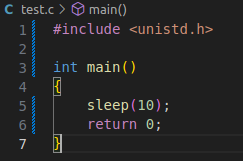
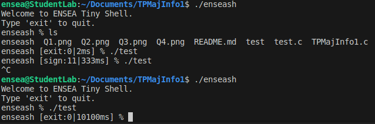
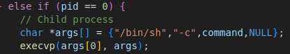
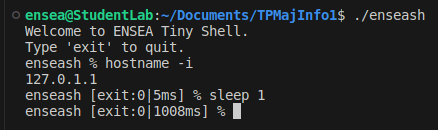
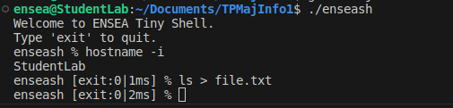

# TPMajInfo1 - Micro Shell Implementation

## Welcome to ENSEA Tiny Shell

### Table of Contents
- [Q.1: Micro Shell Implementation (enseash)](#q1)
- [Q.2: Execution and REPL Loop](#q2)
- [Q.3: Exit Command and CTRL+D](#q3)
- [Q.4: Display Return Code/Signal](#q4)
- [Q.5: Measurement of Execution Time](#q5)
- [Q.6: Execution of Complex Commands](#q6)
- [Q.7: Redirections with `<` and `>`](#q7)

## Q.1: Micro Shell Implementation (enseash) 

Create a micro shell, named `enseash`, for launching commands and displaying information about their execution.

## Q.2: Execution and REPL Loop 

Implement a Read-Eval-Print Loop (REPL) for the micro shell:
- a) Read the command entered by the user.
- b) Execute the command (simple command without arguments).
- c) Print the prompt `enseash %` and wait for a new command.

## Q.3: Exit Command and CTRL+D 

Manage the shell output with the command `exit` or with `<ctrl>+d`.

## Q.4: Display Return Code/Signal 

Display the return code or signal of the previous command in the prompt.

## Q.5: Measurement of Execution Time 

Measure the command execution time using `clock_gettime`.

## Q.6: Execution of Complex Commands 

Implement the execution of complex commands with arguments. But I did question 6, 7 and 8 with the bin/sh file it works but we need a version with strtok.

## Q.7: Redirections with `<` and `>` 

We have now a version with strtok. Manage redirections to stdin and stdout with `<` and `>`.

