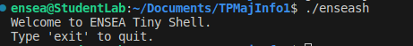
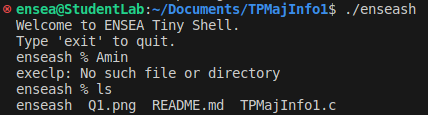
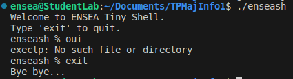
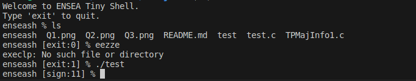

# TPMajInfo1#

MAYIMONA ZANDU Merveille  
KARDELLAS Amin

## Sommaire
- [Q.1](#q1)
- [Q.2](#q2)
- [Q.3](#q3)
- [Q.4](#q4)
- [Q.5](#q5)
- [Q.6](#q6)
- [Q.7](#q7)
- [Q.8](#q8)
- [Q.9](#q9)

## Q.1

Create a micro shell, which you will call enseash, to be used for launching commands and
displaying information about their execution.  

## Q.2
Execution of the entered command and return to the prompt (REPL : read–eval–print
loop) :
- a) read the command entered by user,
- b) execute this command (simple command for the moment, without argument)),
- c) print the prompt enseash % and waits for a new command

## Q.3

Management of the shell output with the command ”exit” or with <ctrl>+d

## Q.4

Display the return code (or signal) of the previous command in the prompt :

